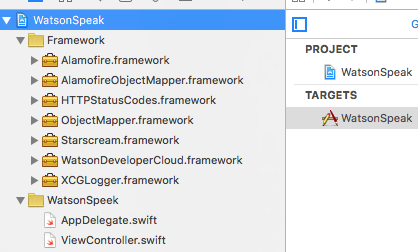
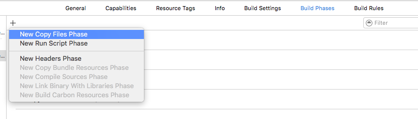
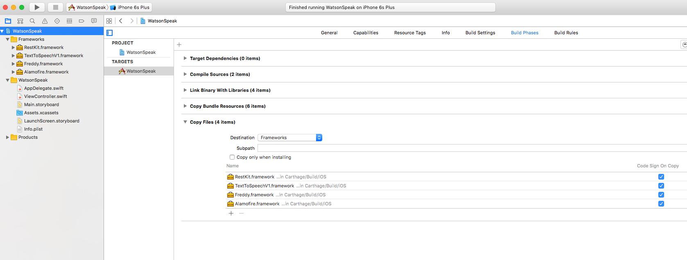
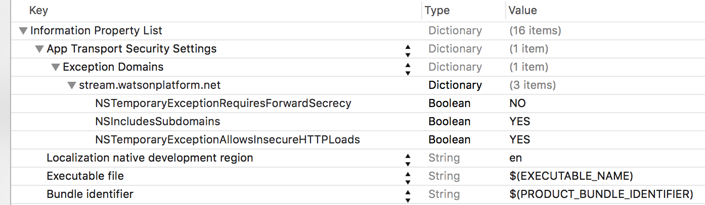
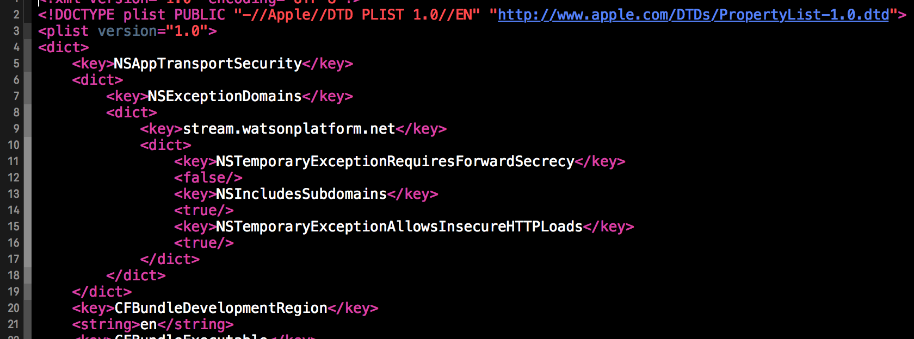
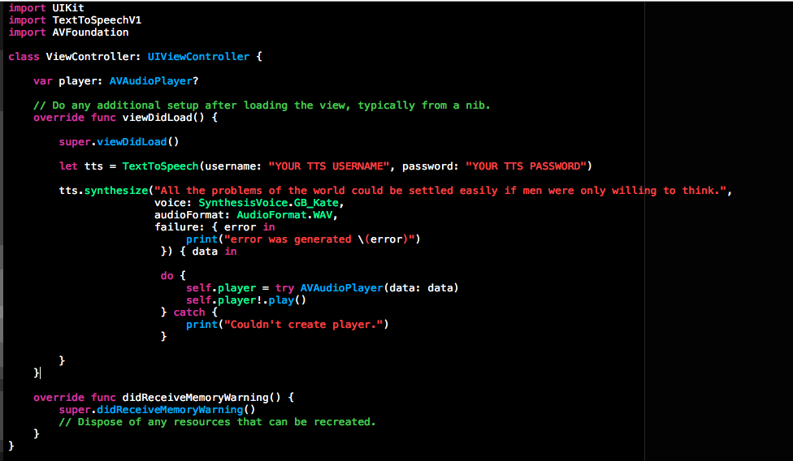

#Quick Start Guide

This is a quick walkthrough to demonstrate how to create an iOS app that uses Watson's Text To Speech service to speak in English.

###Prerequisite

Before beginning to create the iOS application, make sure you set up a BlueMix application and create a Text To Speech service. First, sign up for a Bluemix account. Next, create a new Bluemix application, it can either be Node JS or Liberty application (it does not matter in this example since we will not be deploying any server-side code). Next, setup an instance of the Watson Text to Speech service for that application. When a service gets bound to a Bluemix application, new credentials are automatically generated for making calls to the service. These credentials will be used as part of this getting started guide, and can be found once the service is started by clicking on the “Show Credentials” link on the service. For more information about creating Bluemix applications and attaching Bluemix and Watson services read [Bluemix getting started](https://developer.ibm.com/bluemix/#gettingstarted).

In addition, this quick guide uses Carthage to fetch the Watson Developer Cloud iOS SDK and its dependencies. [Carthage](https://github.com/Carthage/Carthage) provides instruction for [Installing Carthage](https://github.com/Carthage/Carthage#installing-carthage).


###Create a Text to Speech App

1) Create a **"Single View App"** in Xcode and name it "WatsonSpeaks".


2) Fill in the fields for Product Name, Organization Name, and Organization Identifier.  


3) Create a file called "Cartfile" in the root directory of your project and put the following inside the file:

```
# cartfile contents
github "watson-developer-cloud/ios-sdk"
```


4) Run `carthage update --platform iOS` from the command line at the root of the project. If you receive a compile then run the command again.

5) Create a new Group in your Xcode project called "Frameworks".


6) Select all the .framework files in the `Carthage/Build/iOS/` directory of your project (Alamofire, RestKit, Freddy, TextToSpeechV1). Drag-and-drop those files from Finder into the new "Frameworks" group inside of your project in Xcode. When the dialog appears, **make sure** you deselect the option to copy items. This will create a reference to those Framework files without copying them.



7) In Xcode, select the "WatsonSpeaks" project then select its "WatsonSpeaks" build target. In the "Build Phases" tab, add a new **Copy Files Phase** and set its destination to "Frameworks".



8) Add all of the frameworks you added to Xcode to the Copy Files Phase.  Ensure you change the Destination to "Frameworks"



9) Add the following to your info.plist. In order to make network calls to Watson, we need to whitelist the URL to the watsonplatform.net server.

```xml
	<key>NSAppTransportSecurity</key>
	<dict>
		<key>NSExceptionDomains</key>
		<dict>
			<key>watsonplatform.net</key>
			<dict>
				<key>NSTemporaryExceptionRequiresForwardSecrecy</key>
				<false/>
				<key>NSIncludesSubdomains</key>
				<true/>
				<key>NSTemporaryExceptionAllowsInsecureHTTPLoads</key>
				<true/>
				<key>NSTemporaryExceptionMinimumTLSVersion</key>
				<string>TLSv1.0</string>
			</dict>
		</dict>
	</dict>
```





10) Open your ViewController class and add the following under the import of UIKit.

```swift
import UIKit
import TextToSpeechV1
import AVFoundation

```
11) Replace the code over the ***viewDidLoad*** function in the ViewController class:

```swift

    var player: AVAudioPlayer?

    // Do any additional setup after loading the view, typically from a nib.
    override func viewDidLoad() {

        super.viewDidLoad()

        let tts = TextToSpeech(username: "YOUR SERVICE USERNAME", password: "YOUR SERVICE PASSWORD")

        tts.synthesize("All the problems of the world could be settled easily if men were only willing to think.",
                       voice: SynthesisVoice.GB_Kate,
                       audioFormat: AudioFormat.WAV,
                       failure: { error in
                            print("error was generated \(error)")
                        }) { data in

                        do {
                            self.player = try AVAudioPlayer(data: data)
                            self.player!.play()
                        } catch {
                            print("Couldn't create player.")
                        }

        }
    }
```



12) Update the initialization of `TextToSpeech` to use the credentials you obtained in the "Prerequisite" section above.

13) Run application in a Simulator, and you should hear speech coming from the speaker.

14) Enjoy!

Find the source code for this project
[here](https://github.com/IBM-MIL/ios-sdk-watson-speaks/tree/quickstart).

You can review the different voices and languages [here](http://www.ibm.com/watson/developercloud/doc/text-to-speech/using.shtml#voices).

You can download all the source code for the Watson Developer Cloud iOS SDK [here](https://github.com/watson-developer-cloud/ios-sdk).

###Create a Text to Speech app with UI

Fork the project
[here](https://github.com/IBM-MIL/ios-sdk-watson-speaks/tree/master).

Additions to the quick start app:

1) Separated all SDK calls into the ```ToSpeech.swift``` file:
	1. Uses SDK's ```synthesize``` function call to synthesize text to speech.
	2. Uses SDK's ```getVoices``` function call to get all the available voices for people to select from and use.
	3. Loads asynchronous fall and notifies the ViewController with NSNotificationCenter.
2) ViewController now manages the app's UI actions:
	1. Defines a table to display all the voices for users to select from and use.
	2. Allows users to choose which voice they would like to use in order to convert the text to speech.
	3. Adds a text field to allow users to input any text they'd like to output as audio.
	4. Adds user error handling to alert users to select a voice, or that the text field is empty.
	5. Adds a button
3) Main.storyboard uses Auto Layout to format the UI
4) UIViewExtensions adds the ability to make rounded corners, define border widths and colors for any objects.

Things to note:

1) All voices are loaded as an option to use. Foreign voice selections (i.e. 'ja-JP_Emi') are expecting the text input to be in Japanese; however, using English in the text field and selecting that voice will produce an audio that pronounces English with a Japanese accent.
2) Default voice for options not included in the ```pressedSpeakButton``` switch cases is Kate's British voice.
