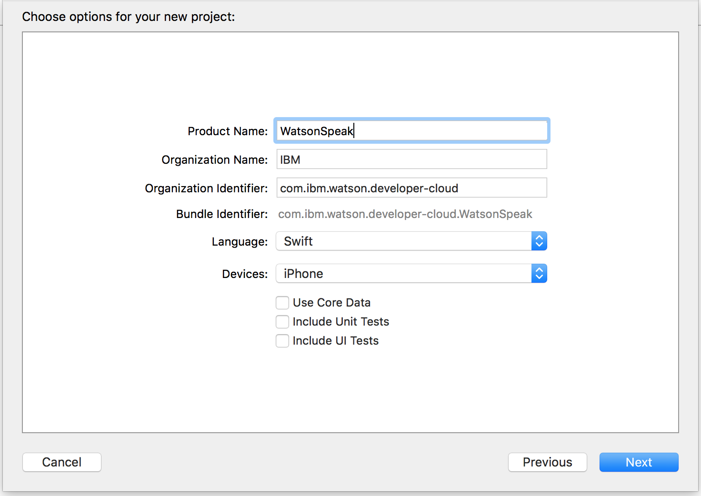
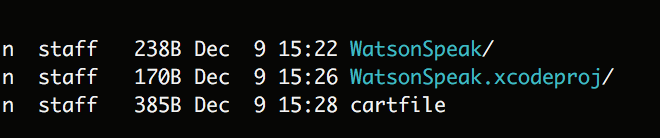
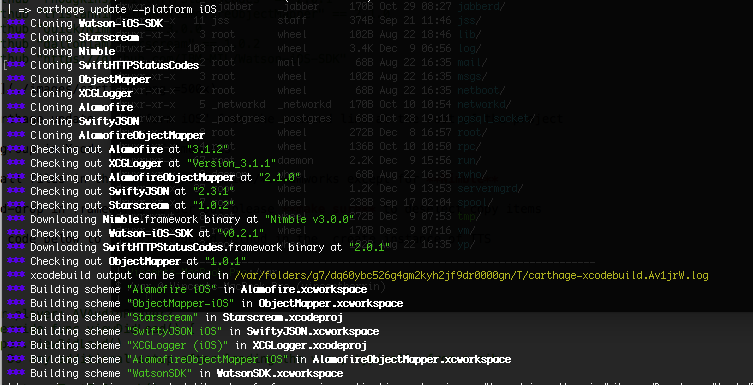
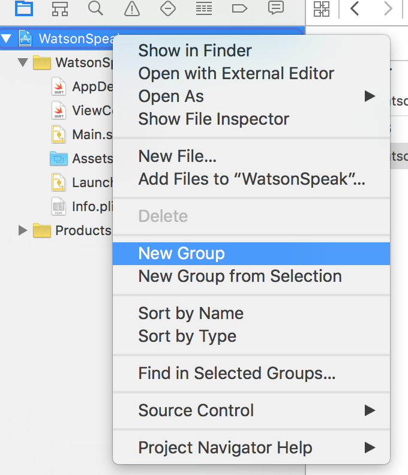
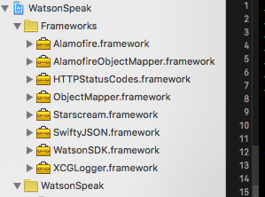
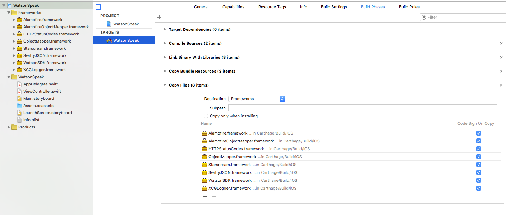
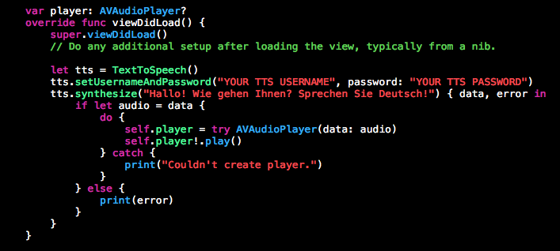
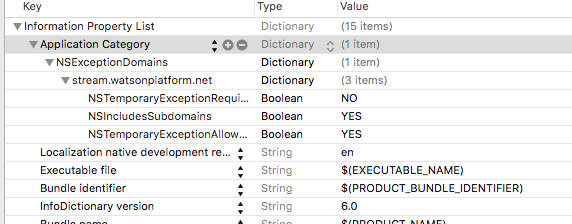

#Quick Start Guide

This is a quick walkthrough to demonstrate how to create a iOS app that uses Watson's Text To Speech service to speak German.

###Prerequisite 

Before beginning to create the iOS client, make sure you set up your BlueMix application and create a Text To Speech service. First, sign up for a Bluemix account. Next, create a new Bluemix application, it can either be Node JS or Liberty application, it does not matter in this example since we will not be deploying any server-side code. Next, setup an instance of the Watson Text to Speech service for that application. When a service gets bound to a Bluemix application, new credentials are automatically generated for making calls to the service. These credentials will be used as part of this getting started guide, and can be found once the service is started by clicking on the “Show Credentials” link on the service. [Bluemix getting started](https://developer.ibm.com/bluemix/#gettingstarted)

In addition, this quick guide uses Carthage to fetch necessary depedencies that the Watson iOS SDK requires. You can install  [Carthage](https://github.com/Carthage/Carthage) by following **"Installing Carthage"** section. If you use Homebrew you can simply run "brew install carthage".


###Create a Text to Speach App

1) Create a **"Single View App"** in XCODE 


2) Fill in the fields Project Name, Organization Name, Organization Indentifier, Bundle Identifier fields  



3) Create cartfile using the information below

        # cartfile contents
        github "SwiftyJSON/SwiftyJSON" == 2.3.1
        github "Alamofire/Alamofire" == 3.1.2
        github "DaveWoodCom/XCGLogger" == 3.1.1
        github "Hearst-DD/ObjectMapper" == 1.0.1
        github "rhodgkins/SwiftHTTPStatusCodes" == 2.0.1
        github "tristanhimmelman/AlamofireObjectMapper" == 2.1.0
        github "Quick/Nimble" == 3.0.0
        github "daltoniam/Starscream" == 1.0.2
        github "https://github.com/IBM-MIL/Watson-iOS-SDK"



4) Run "carthage update --platform iOS" from the command line at the root of the project.  The off chance you receive a compile failure for framework AlamofireObjectMapper so just rerun the carthage update command another time.



5) Create group in Xcode called Frameworks



6) Select all files in the carthage/build/ios/*.framworks except for **Nimble** and drag-and-drop into the frameworks group but please **make sure** to deselect copy items



7) Select the project target and add **New Copy File Phase** available in Build Phases


8) Add the frameworks to the Copy Files Phase



8) Add **import WatsonSDK** below import UIKit in the ViewController class

9) Add the code below to the viewDidLoad method in the ViewController class

```swift
        var player: AVAudioPlayer?    
        override func viewDidLoad() {
        super.viewDidLoad()
        // Do any additional setup after loading the view, typically from a nib.
        
        let tts = TextToSpeech()
        tts.setUsernameAndPassword("YOUR TTS USERNAME", password: "YOUR TTS PASSWORD")
        tts.synthesize("Hallo! Wie gehen Ihnen? Sprechen Sie Deutsch!") { data, error in
            if let audio = data {
                do {
                    self.player = try AVAudioPlayer(data: audio)
                    self.player!.play()
                } catch {
                    print("Couldn't create player.")
                }
            } else {
                print(error)
            }
        }
     }
```



10) Set username and password in the setUserNameAndPassword function

11) Add the plist information to the info.plist in the WatsonSpeek app to whitelist the URI

    <?xml version="1.0" encoding="UTF-8"?>
    <!DOCTYPE plist PUBLIC "-//Apple//DTD PLIST 1.0//EN" "http://www.apple.com/DTDs/PropertyList-1.0.dtd">
    <plist version="1.0">
    <dict>
        <key>NSExceptionDomains</key>
        <dict>
            <key>stream.watsonplatform.net</key>
            <dict>
                <key>NSTemporaryExceptionRequiresForwardSecrecy</key>
                <false/>
                <key>NSIncludesSubdomains</key>
                <true/>
                <key>NSTemporaryExceptionAllowsInsecureHTTPLoads</key>
                <true/>
            </dict>
        </dict>
    </dict>
    </plist>



12) Run application and you should hear speech from the simulator

13) Enjoy!


You can download all the source code for the Watson iOS SDK [here](https://github.com/IBM-MIL/Watson-iOS-SDK)

